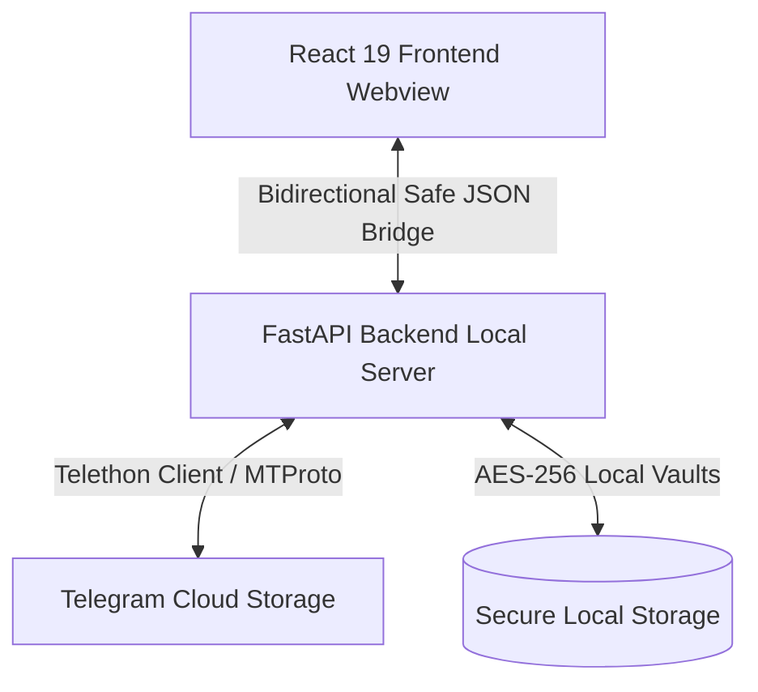

# <div align="center">☁️ Telegrab</div>

<div align="center">
  <h3>Turn Telegram into your high-speed, unlimited, and private cloud storage.</h3>
  <p>No storage caps. No monthly subscriptions. Just your files — on the cloud you already trust.</p>
</div>

<p align="center">
  
  
  
  
</p>

---

## ✨ Features

- **🚀 Max-Speed Transfer Engine**
  Powered by a custom-engineered multi-connection chunking engine, Telegrab splits files into optimal parts and uploads/downloads them in parallel, unlocking your network's maximum potential speed.
- **📁 Fluid Desktop File Explorer**
  Enjoy a sleek, Linear-inspired interface with fluid animations, drag-and-drop mechanics, full folder structures, instant search, and visual list/grid view toggles.
- **🎬 Instant Media Streaming**
  Watch HD/4K videos or listen to audio tracks instantly via high-efficiency local streaming without waiting for the full file download.
- **🔒 Vault Secure Encryption**
  Secure your sensitive directories and personal files with local, AES-256 encrypted vaults.
- **🔌 Offline-Resilient Transfer Queue**
  Add files to transfer queues offline. Telegrab handles network changes gracefully, automatically pausing transfers and resuming them once connection is restored.
- **🔄 Auto-Updates & Single Instance Lock**
  Keeps itself updated seamlessly and prevents session database corruption using a multi-process mutex lock.

---

## 🏗️ Architecture & Technology Stack

Telegrab is split into a high-performance Python backend managing the MTProto Telegram client and a highly responsive React frontend running in a native webview container.



* **Frontend**: React 19 • TypeScript • Tailwind CSS • Vite • Framer Motion • TanStack Query & Virtualizer (for rendering massive folders smoothly)
* **Backend**: Python 3.12 • Telethon (MTProto client) • FastAPI • PyInstaller (packaging)
* **Desktop Layer**: Python-Webview (utilizing system native engines WebView2 on Windows, WebKit2GTK on Linux, and WebKit on macOS)

---

## 🚀 Quick Start for Users

1. **Download the Client**
   Grab the latest installer or portable executable for your operating system from the **[Releases](https://github.com/jithin-jz/telegrab/releases)** tab.
2. **Retrieve your Telegram API Keys**
   To log in, you will need a personal API ID and Hash.
   * Go to **[my.telegram.org](https://my.telegram.org)**.
   * Log in with your phone number and navigate to **API development tools**.
   * Copy the `api_id` and `api_hash`.
3. **Connect and Run**
   Launch Telegrab, paste your API credentials, and log in securely via Phone Number + OTP code or Telegram's QR Code sign-in.

---

## 💻 Developer Setup & Installation

If you want to run Telegrab locally or contribute to development, follow the setup instructions below.

### Prerequisites
* **Python 3.12+**
* **Node.js 20+ & npm**

### 1. Clone the Repository
```bash
git clone https://github.com/jithin-jz/telegrab.git
cd telegrab
```

### 2. Setup the Python Backend
Initialize a virtual environment and install the backend package in editable mode:
```bash
# Windows
python -m venv backend\.venv
backend\.venv\Scripts\activate
pip install -e ./backend
pip install pytest ruff pyinstaller pillow

# macOS / Linux
python3 -m venv backend/.venv
source backend/.venv/bin/activate
pip install -e ./backend
pip install pytest ruff pyinstaller pillow
```

### 3. Setup the Frontend
Install dependencies and build the developer assets:
```bash
cd frontend
npm install
npm run dev
```

### 4. Run the Application
From the repository root (with your virtual environment activated):
```bash
python run.py
```

---

## 🧪 Running Tests
The backend includes a comprehensive suite of unit tests verifying transfer reliability, vault encryption, network recovery, and bridge stability:
```bash
pytest backend/tests/ -v
```

---

## 🤝 Credits & Inspiration

* **[Telegram-Drive](https://github.com/caamer20/Telegram-Drive)** by [@caamer20](https://github.com/caamer20) — Served as the core design inspiration. Telegrab is a complete performance-focused rewrite in Python with native webview bindings.

---

## 📄 License & Disclaimer

This project is licensed under the MIT License. See [LICENSE](LICENSE) for details.

> ⚠️ **Disclaimer**: This application is an unofficial client and is not affiliated with, sponsored by, or endorsed by Telegram FZ-LLC. Use responsibly and in accordance with Telegram's Terms of Service.
