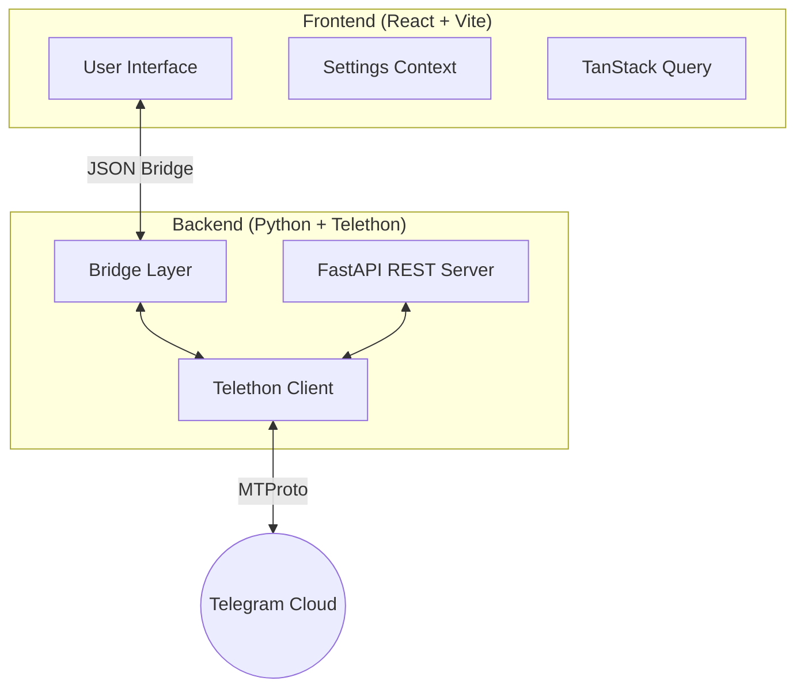
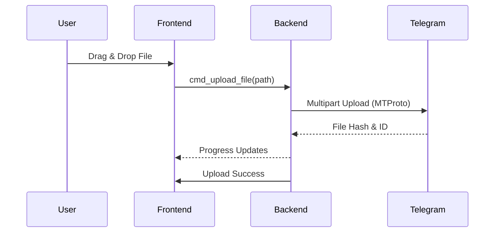

# Telegrab

  

<h3 align="center">Your Files, Reimagined.</h3>

  <b>Telegrab</b> is a high-performance, privacy-centric desktop application that transforms your Telegram account into an encrypted, unlimited, and free cloud storage solution.

  
  
  
  

---

## 🚀 Overview

Telegrab bridges the gap between Telegram's massive cloud infrastructure and a traditional file explorer experience. By leveraging the **MTProto** protocol, it allows you to store, manage, and stream files directly from Telegram's servers without any third-party intermediaries.

### Why Telegrab?

- **Zero Costs**: No subscription fees or storage caps—ever.
- **Privacy First**: Files are handled directly between your machine and Telegram. No middleware servers involved.
- **Modern Experience**: A sleek, GPU-accelerated interface built with React and Framer Motion.

---

## 🏗️ Architecture

Telegrab uses a hybrid architecture combining a high-concurrency Python backend with a reactive TypeScript frontend.

---

## ✨ Key Features

### 📁 Advanced File Management
A fully-featured explorer supporting drag-and-drop, custom folders, and bulk operations.
- **Infinite Hierarchy**: Organize your cloud with nested folders.
- **Smart Selection**: Multi-select with Shift/Ctrl, bulk download, and bulk move.

### 🎥 Seamless Media Streaming
High-performance streaming engine with HTTP Range request support.
- **Instant Playback**: Watch 4K videos or listen to lossless audio without waiting for the full download.
- **Deep Seeking**: Jump to any timestamp instantly.

### 🛠️ Automation & API
Telegrab exposes an optional, authenticated REST API for developers.
- **Headless Integration**: Programmatically upload/download files.
- **AI-Ready**: Feed your Telegram data into LLM pipelines or other local tools.

---

## 🛠️ Technical Stack

| Layer | Technology |
| :--- | :--- |
| **Interface** | React 18, TypeScript, Tailwind CSS, Framer Motion |
| **State** | TanStack Query (React Query), Context API |
| **Engine** | Python 3.11+, Telethon (MTProto), FastAPI |
| **Runtime** | pywebview (WebView2 on Windows, WebKit on macOS) |
| **Build System** | Vite, PyInstaller, GitHub Actions |

---

## 📥 Installation

### 1. Download
Visit the [Releases](https://github.com/jithin-jz/telegrab/releases) page and download the installer for your platform:
- **Windows**: `telegrab-setup.exe`
- **macOS**: `telegrab.dmg`

### 2. Configuration
On first launch, you will need your **Telegram API Credentials**:
1. Login to [my.telegram.org](https://my.telegram.org).
2. Go to **API development tools**.
3. Create a new application to get your `api_id` and `api_hash`.

---

## 🔄 Data Flow

---

## 🤝 Credits

Telegrab is a modern evolution of the original [**Telegram-Drive**](https://github.com/caamer20/Telegram-Drive) project by [@caamer20](https://github.com/caamer20). 

While the core concept remains the same, Telegrab is a ground-up rewrite in Python, optimized for performance, security, and a premium user experience.

---

## 📄 License

This project is licensed under the **MIT License**. See the [LICENSE](LICENSE) file for details.

---

  
    <i>Disclaimer: This application is not affiliated with Telegram FZ-LLC. Use responsibly and in accordance with Telegram's Terms of Service.</i>
  

